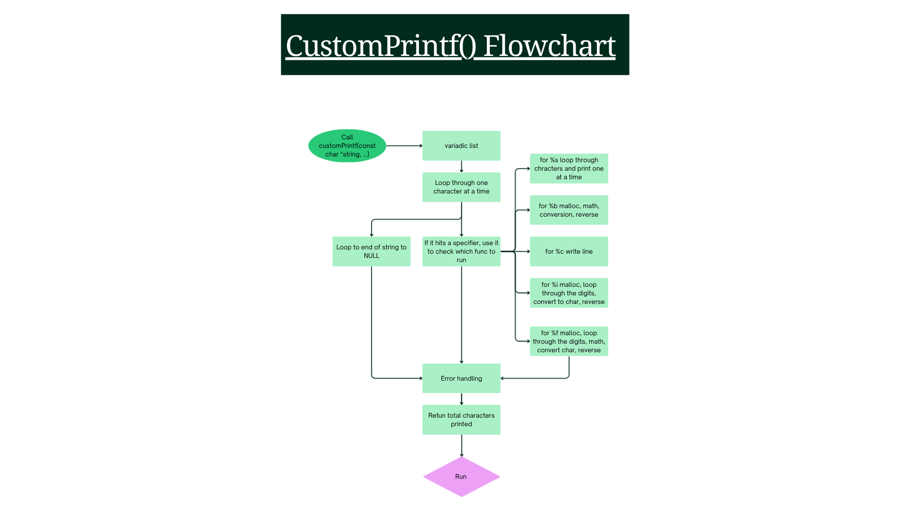

# Custom printf Implementation

In this project, we created a custom implementation of printf() to handle format specifiers c, s, d, f, b, %, and nonspecifier. It utilizes variadic functions, custom memory management, and function pointer-based dispatching to format and print data to standard output. The goal is to provide a deeper understanding of how system level I/O and variable argument handling function in C.

## Authors

- Josh Cleveland [@jcleve](https://github.com/jcleve00)
- Wynoami Glasser [@wynoami](https://github.com/wynoami)

## Flowchart 

Here is a flowchart of how we designed the program to run crafted in Canva.

## Description of Project

This project invloves the development of a custom C library function, `customPrintf()`, which replicates the functionality of the standard `printf()` library function. The objectice was to build a variadic function capable of parsing a format string and dynamically formatting various data types, including characters, strings, integers, binary integers, and floating-point numbers.

Some of the key challenges we addressed are:
- Memory Management:Implementing dynamic memory allocation `malloc` and deallocation `free` to safely handle data types that lack a fixed string representation.
- Systems Programming: Bypassing the standard library's buffered output by leveraging the `write()` system call for direct interaction with the standard output file descriptor.
- Architecture: Moving away from standard `switch` chains in favor of a dispatch table, utilizing an array of `FormatSpec` structures and function pointers for fast lookups.

By completing this project, we have gained a functional understanding of how C interprets variable argument lists, how data is represented at the binary level, and how to maintain strict memory hygiene in C. 

## How to Run project

To compile the project with the required srict standards, use the following GCC command: 
    `gcc -Wall -Werror -Wextra -pedantic -g -std=c11 -o main *.c`

## Project structure breakdown

The project is organized for modularity and maintainability:

- custom_printf.h: Contains the FormatSpec struct, library imports, and global function prototypes.
- custom_printf.c: The core engine; handles the variadic argument loop and the dispatch logic for specifiers, as well as the logic for printing characters, strings, integers, binary numbers, and floating-point values.
- print_binary.c: Contains the function definition for printBinary. Function takes
a reference to va_list args as an argument. Converts integer to binary and writes the result. 
- print_char.c: Contains the function definition for printChar. Function takes
a reference to va_list args as an argument. Writes the character.
- print_float.c: Contains the function definition for printFloat. Function takes
a reference to va_list args as an argument. Separates the whole integer part from the floating point number and writes it. Then writes the decimal and the fractional part.
- print_int.c: Contains the function definition for printInt. Function takes
a reference to va_list args as an argument. Converts the integer to chars by % 10, writing the digit, then removing the digit by / 10.
- print_string.c: Contains the function definition for printString. Function takes
a reference to va_list args as an argument. Loops through the string and writes the chars one at a time.
- test_functions.c: Contains the functions for testing the various uses of customPrintf: testChar(), testString(), testInt(), testFloat(), testBinary(), and testMultipleSpecifiers().
- main.c: Contains the menu display for the user's selection.

## Explanations

- Dispatch Table: Instead of using complex `switch` statements, we mapped format specifiers to their respective functions using an array of `FormatSpec` structs. This provides an efficient, readable way to look up and execute printing logic. 
- Variadic Functions: We utilized `<stdarg.h>` to access the variadic function argument list (`va_list`). By iterating through the format string, we call the appropriate helper function only when a `%` specifier is encountered once. 
- `va_list` Pointers: We pass the `va_list` to the functions by reference to ensure that all functions are sharing the same list and not copies. This allows the `va_list` to advance properly when multiple specifiers are used. 
- Low-Level I/O: The `write()` system call is used to send data directly to file descriptor `1` (stdout), which ensures high performance and precise control over the character count returned by our function.
- Dynamic Memory: For complex types like floats, `malloc` is used to allocate temporary buffers, which are subsequently freed to keep the heap clean. 

## What was not completed or what would we run?

- We have not implemented precision handling for floats (e.g., `.2f`).
- Flag support is not included in this build (e.g., `+`, `#`, `0`).

## Error, Run, & Build issues

- Character Count: Whitespace was not accounted for and it threw of the total character count.
- Segmentation Fault: Because we initially passed `va_list` by value, functions were receiveing a copy of the list every time a format specifier was flagged. When only one specifier was in the list this caused no issues. However, when multiple specifiers were used this caused unexpected results. On a computer with Intel architecture no issues were observed, while on Apple Silicon a segmentation fault occured.
- Strict Flags: Because we are using `-Werror`, any unused variables or type mismatches will trigger a build failure. All code is currently sanitized to pass these warnings.

## Environment

- Compiler: GCC 13.x or higher
- Standard: C11
- Development Host: Wynoami - Windows 11 (VS Code), Josh - macOS Tahoe (VS Code)
- Development Runtime: Linux (via Dev Containers)
- Version Control: GitHub
- Repository: https://github.com/jcleve00/custom_printf.git
